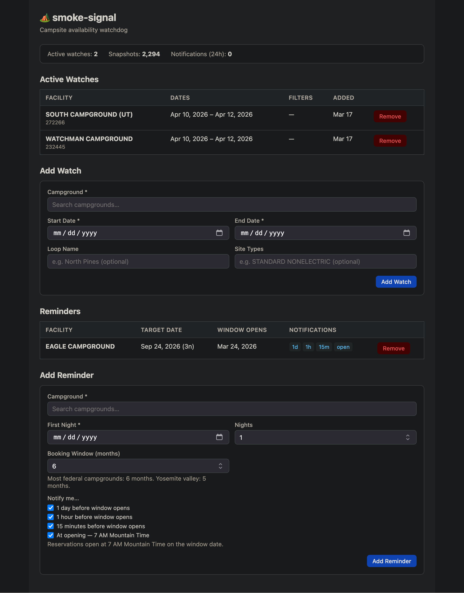

# smoke-signal

⛺️ Get the signal when a campsite opens up.

Monitors [Recreation.gov](https://recreation.gov) for cancellations and sends push notifications via [ntfy.sh](https://ntfy.sh). Runs entirely on Cloudflare Workers — no server, no cost.



---

## How it works

A cron-triggered Cloudflare Worker checks campsite availability every 15 minutes. When a site transitions from unavailable to **Available**, you get an instant push notification with a direct booking link.

```
Cloudflare cron (*/15 * * * *)
  → fetch Recreation.gov availability API
  → diff against last known state (D1 database)
  → site opened up? → push notification via ntfy.sh
                    → log to D1
```

There are two types of alerts:

- **Watches** — monitor a campground date range for cancellations. Notifies you the moment a site opens up.
- **Reminders** — alert you before a booking window opens so you're ready to book the instant reservations go live. Fires at 1 day, 1 hour, 15 minutes, and exactly at opening (7 AM Mountain Time).

---

## Quick start

### 1. Prerequisites

- [Cloudflare account](https://dash.cloudflare.com/sign-up) (free)
- [Wrangler CLI](https://developers.cloudflare.com/workers/wrangler/) — `npm install -g wrangler`
- [ntfy app](https://ntfy.sh) on your phone

### 2. Clone and install

```bash
git clone https://github.com/garrettwheald/smoke-signal
cd smoke-signal
npm install
```

### 3. Create the D1 database

```bash
wrangler d1 create smoke-signal
```

Copy the `database_id` from the output into `wrangler.toml`.

### 4. Apply the schema

```bash
npm run migrate:remote
```

### 5. Set your ntfy topic

Pick an unguessable topic name — it's your only access control on ntfy's free tier:

```bash
wrangler secret put NTFY_TOPIC
# enter something like: smoke-signal-8ffe11e6-4d6d-4a30-9e38-1f444a064dc9
```

Subscribe to the same topic in the ntfy app on your phone.

### 6. Deploy

```bash
npm run deploy
```

### 7. Add a watch or reminder

Open the management UI at your worker URL (e.g. `https://smoke-signal.<your-subdomain>.workers.dev`). Search for a campground by name, set your dates, and hit Add Watch.

The worker will check availability on the next cron tick. The first run seeds the snapshot baseline — notifications fire on subsequent runs when a site opens up.

---

## Campground search

The UI includes a fuzzy search across 4,000+ Recreation.gov camping facilities sourced from RIDB historical data. Search by campground name, park, or state — e.g. "lower pines", "yosemite", or "north pines ca". If your campground isn't listed, choose "Other" to enter a facility ID manually.

**Finding a facility ID manually:**

1. Go to [recreation.gov](https://recreation.gov) and find your campground
2. The URL contains the facility ID: `recreation.gov/camping/campgrounds/232450`

---

## Booking windows

Recreation.gov opens reservations on a rolling basis. New dates become bookable at **7 AM Mountain Time**, typically 6 months in advance (5 months for Yosemite valley campgrounds).

Use **Reminders** to get notified at 1 day, 1 hour, 15 minutes, and right at opening so you can book the moment the window goes live.

---

## Management API

The worker serves a management UI at `/` and a JSON API at `/api/*`.

| Method   | Path                       | Description                                            |
| -------- | -------------------------- | ------------------------------------------------------ |
| `GET`    | `/api/watches`             | List active watches                                    |
| `POST`   | `/api/watches`             | Create a watch                                         |
| `DELETE` | `/api/watches/:id`         | Deactivate a watch                                     |
| `GET`    | `/api/watches/:id/history` | Notification history for a watch                       |
| `GET`    | `/api/reminders`           | List pending booking window reminders                  |
| `POST`   | `/api/reminders`           | Create a reminder                                      |
| `DELETE` | `/api/reminders/:id`       | Delete a reminder                                      |
| `GET`    | `/api/status`              | Active watches, snapshot count, 24h notification count |

### Watch object

```json
{
  "facility_id": "232450",
  "facility_name": "Lower Pines",
  "start_date": "2026-07-01",
  "end_date": "2026-07-31",
  "loop_name": "NORTH PINES",
  "site_types": ["STANDARD NONELECTRIC"],
  "site_ids": null,
  "notify_push": true
}
```

All filter fields (`loop_name`, `site_types`, `site_ids`) are optional — omit them to watch all sites at the facility.

### Reminder object

```json
{
  "facility_id": "232450",
  "facility_name": "Lower Pines",
  "target_date": "2026-07-04",
  "nights": 2,
  "window_months": 6,
  "notify_schedule": [-1440, -60, -15, 0]
}
```

`notify_schedule` is a JSON array of minute offsets relative to window open time. Negative values fire before the window opens; `0` fires at opening.

---

## Auth

Set up [Cloudflare Access](https://developers.cloudflare.com/cloudflare-one/applications/configure-apps/) in front of your worker URL to gate the management UI behind your email. The cron-triggered checker bypasses Access automatically — only HTTP requests go through it.

---

## Local development

```bash
cp .dev.vars.example .dev.vars
# fill in NTFY_TOPIC with your topic name

npm run migrate:local
wrangler dev --test-scheduled
```

Trigger a manual check:

```bash
curl "http://localhost:8787/__scheduled?cron=*%2F15+*+*+*+*"
```

Test the ntfy channel independently:

```bash
npx tsx scripts/test-notify.ts
```

---

## Configuration

| Variable      | Where                    | Description                                  |
| ------------- | ------------------------ | -------------------------------------------- |
| `NTFY_SERVER` | `wrangler.toml` `[vars]` | ntfy server URL (default: `https://ntfy.sh`) |
| `NTFY_TOPIC`  | `wrangler secret put`    | Your ntfy topic — keep this private          |

---

## Responsible use

Recreation.gov's availability endpoint is undocumented and provided as-is. This tool defaults to 15-minute check intervals. Please don't decrease the interval below 5 minutes or monitor an unreasonable number of campgrounds. If everyone hammers the API, it'll get locked down.

---

## Architecture

```
Cloudflare Worker
├── scheduled()   ← cron every 15min
│   ├── runCheck()         fetch availability, diff snapshots, notify on cancellations
│   └── runReminderChecks() fire booking window alerts at scheduled offsets
└── fetch()       ← HTTP requests
    ├── GET /     management UI (fuzzy campground search, 4,035 facilities)
    └── /api/*    JSON API (Hono)

D1 Database
├── watches                 active campground monitors
├── availability_snapshots  last known state per (watch, site, date)
├── reminders               booking window alerts with per-offset notification schedule
└── notification_log        sent notification history
```

---

Built with [Claude Code](https://claude.ai/claude-code).
